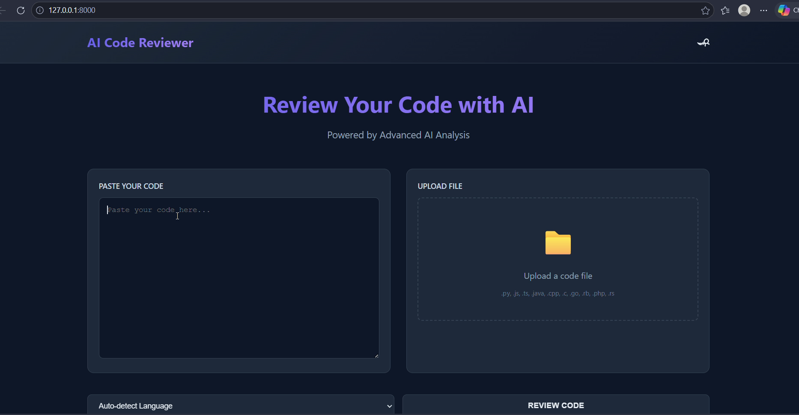
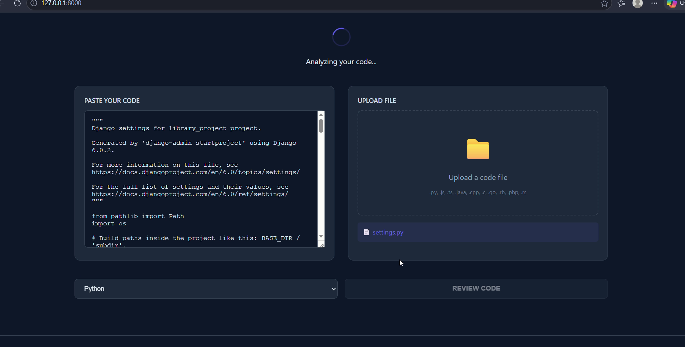
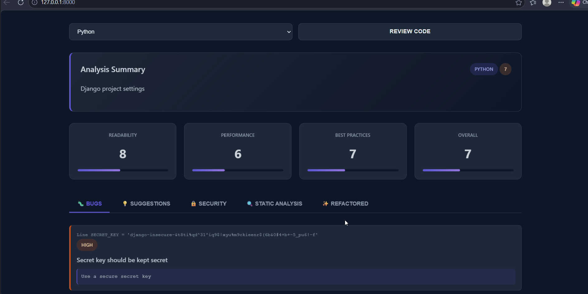

# 💻 AI Code Reviewer

### AI-Powered Code Analysis, Security Review & Refactoring Platform

AI Code Reviewer is a web application that combines static analysis and Large Language Models to review code, detect bugs, identify security vulnerabilities, analyze complexity, and generate refactored implementations.

🌐 **Live Demo:** https://code-reviewer-5afr.onrender.com/

---

## 📈 Impact

- 👨‍💻 Used by **60+ developers**
- 🌍 Supports **10+ programming languages**
- ⚡ Reduced unnecessary LLM requests by **35%** through AST-based pre-analysis
- 🔍 Performs bug detection, security analysis, complexity evaluation, and automated refactoring

---

## 🎯 Problem Statement

Manual code reviews can be slow and inconsistent. AI Code Reviewer helps developers identify bugs, security risks, performance issues, and code quality concerns instantly through a combination of static analysis and AI-powered reasoning.

---

## ✨ Key Features

- 🐞 Bug Detection & Severity Analysis
- 🔐 Security Vulnerability Scanning
- 📊 Code Quality Scoring
- ⚙️ AST-Based Static Analysis
- ⏱️ Time & Space Complexity Analysis
- 🚀 Automated Code Refactoring
- 🔄 Side-by-Side Diff View
- 🌙 Modern Dark-Themed UI

---

## 📸 Screenshots


### 🏠 Home Page




### 💻 Code Input




### 🤖 AI Review Output



---

## 🏗️ Architecture

```text
User Code
    │
    ▼
Language Detection
    │
    ▼
AST Static Analysis
    │
    ▼
Groq LLaMA 3 Processing
    │
    ▼
Bug Detection
Security Analysis
Complexity Evaluation
Refactoring Suggestions
    │
    ▼
Review Report
```

---

## 🛠️ Tech Stack

**Backend:** Django, Python

**AI Engine:** Groq API, LLaMA 3 70B

**Static Analysis:** Python AST

**Frontend:** HTML, CSS, JavaScript

**Deployment:** Render

---

## 💡 Engineering Challenges Solved

- Combined AST-based analysis with LLM reasoning
- Reduced unnecessary AI calls using static pre-analysis
- Designed structured JSON review pipelines
- Built multi-language code review workflows
- Implemented automated diff generation for code comparison

---

## 📚 Skills Demonstrated

Django • REST APIs • Static Analysis • AST Processing • LLM Integration • Prompt Engineering • Security Analysis • Full Stack Development • Production Deployment

---

## 👨‍💻 Author

**Rajshekhar Singh**

🌐 Portfolio: https://my-portfolio-9wb7.onrender.com

💼 LinkedIn: https://www.linkedin.com/in/rajshekhar-singh-572574276

💻 GitHub: https://github.com/Rajshekhar061

---

⭐ If you found this project useful, consider starring the repository.
